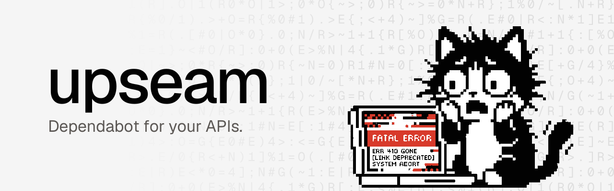

  <picture>
    <source media="(prefers-color-scheme: dark)" srcset=".github/assets/upseam-banner-dark.svg" />
    
  </picture>

# Upseam

**Dependabot for your APIs.** An API you call changes; you get a pull request.

[**Try for free ↗**](https://app.upseam.dev) · [Docs](https://docs.upseam.dev/) · [Demo](https://github.com/upseam/demo) · [Vote for the next API](https://app.upseam.dev/vote) ·
[Privacy](https://docs.upseam.dev/privacy/) · [Security](SECURITY.md)

## What it does

- Reads vendor changelogs and finds the lines of your code a change touches.
- Opens a pull request that fixes the mechanical changes and flags the rest.
- Writes the fix with the model or coding agent you choose.

## Supported

- **Payments and commerce:** Stripe, Shopify (Admin and Storefront APIs).
- **AI models:** OpenAI, Anthropic Claude, Google Gemini (retired models).
- **Languages:** JavaScript, TypeScript and Python.
- Versions and detection per vendor: [Providers](https://docs.upseam.dev/providers/).

## Three ways in

- **[Action](https://github.com/upseam/action):** `- uses: upseam/action@v0`. A free weekly report on the run page: deadlines first, then each finding linked to its line. No App, account, model or token.
- **[App](https://docs.upseam.dev/install/):** free during the beta. `ask` waits for a person, `auto` opens pull requests right away; Slack is optional.
  [How it works](https://docs.upseam.dev/how-it-works/) · [Delivery modes](https://docs.upseam.dev/delivery-modes/) · [Connect a model](https://docs.upseam.dev/models/) · [Bring your own agent](https://docs.upseam.dev/own-agent/)
- **[CLI](https://docs.upseam.dev/cli/):** `npx @upseam/cli inspect stripe .` locally or in CI. No account, no server; Node.js 22 or later.

## Trust

- Upseam never merges. Pushes go to `upseam/*` branches only, and your CI runs the result.
- [Trust and your data](https://docs.upseam.dev/trust/) · [Security model](https://docs.upseam.dev/security/) · [Privacy](https://docs.upseam.dev/privacy/)

## Feedback and security

- Bugs, feedback and provider requests: [GitHub Issues](https://github.com/upseam/upseam/issues/new/choose).
- Private matters and vulnerabilities: [contact@upseam.dev](mailto:contact@upseam.dev), see [SECURITY.md](SECURITY.md).

MIT licensed.
